# Use Summary Tables Extractor

## Problem

Pesticide label PDFs contain critical use information scattered across narrative sections,
rate tables, crop tables, and appendices. Regulators, applicators, and analysts need this
data in a **structured, queryable format** — not embedded in unstructured PDF text.

**Manual extraction is:**
- **Time-consuming**: 45–90 min per label
- **Error-prone**: Easy to miss footnotes, appendices, or conditional rates
- **Inconsistent**: Different analysts may interpret the same label differently

**This tool solves the problem** by automating the extraction of every crop, use site, and
application method into a 27-column schema-compliant table, with human verification built in.

The output is ready to load into regulatory databases or analysis systems — **no reformatting needed**.

## Solution

A browser-based prototype that extracts **Use Summary Tables** from pesticide label PDFs.
Upload one or more labels, click **Run Extraction**, and get a complete, schema-compliant table
of every crop and every use — rendered on screen and downloadable as Excel (`.xlsx`).

## How to run

No build step and no server required:

```sh
open app/index.html
```

Or double-click `app/index.html` in Finder. PDF.js and SheetJS load from a CDN, so an internet
connection is needed on first load.

## Architecture

The extractor uses a **regex + heuristic pipeline** running entirely client-side:

```mermaid
graph LR
    A["PDF Upload<br/>(one or more)"] -->|PDF.js| B["Text Extraction<br/>(per-page text)"]
    B -->|Regex Patterns| C["Field Parser<br/>(60+ patterns)"]
    C -->|Derivation Rules| D["Schema Mapping<br/>(27 columns)"]
    D -->|Confidence Scoring| E["Validation<br/>(High/Med/Low)"]
    E -->|Human Review| F["Inline Editing<br/>(double-click cells)"]
    F -->|SheetJS| G["Export<br/>(Excel/CSV)"]
    
    style A fill:#e1f5ff
    style B fill:#fff3e0
    style C fill:#f3e5f5
    style D fill:#e8f5e9
    style E fill:#fce4ec
    style F fill:#fff9c4
    style G fill:#e0f2f1
```



**Key Components:**
1. **PDF.js (CDN)**: Extracts text layer from PDFs; reports pages with no text for OCR
2. **Regex Patterns**: 60+ field-specific patterns recognize rates, timings, restrictions, equipment
3. **Derivation Rules**: Computes derived fields (e.g., `Max # Apps/Yr = Total Rate/Yr ÷ Single Rate`)
4. **Confidence Scoring**: Scores each row High/Medium/Low based on field fill percentage
5. **Human Review UI**: Inline editing, page references, source text expansion, live search
6. **SheetJS (CDN)**: Generates Excel files; includes audit columns (Page, Source, Confidence)

**No external APIs, no backend server, no authentication — everything runs in the browser.**

## Results

**Current Extraction Performance (v9)**

| Metric | Value |
|--------|-------|
| **Overall Field-Level Precision** | 82% |
| **Row Recall** | 100% (156/156 rows matched) |
| **Schema Compliance** | 100% (27/27 columns) |
| **Test Set** | 5 pesticide labels, 156 uses |

**Precision by Field (top challenges):**
| Field | Precision | Notes |
|-------|-----------|-------|
| A.I. Max Single Rate | 98% | Strongest field; standard rate format |
| Max # Apps/Yr | 0-5% | Depends on Total Rate/Yr extraction (in progress) |
| Equipment | 70% | Multi-line equipment descriptions |
| Drift Restrictions | 14% | Multi-line buffers, complex formatting |
| Soil Restrictions | 14% | Nested condition statements |
| Geographic Restrictions | 66% | Partial capture of multi-line text |
| Additional Information | 17% | Unstructured, inherently difficult |

**Performance Improvements (recent fixes):**
- Multi-line text capture: Fixed Drift/Soil patterns to span line breaks
- Equipment extraction: Extended pattern lengths for full chemigation sentences
- Rate derivation: Added alternative patterns for "Total Rate per Year" formats
- UI clarity: Collapsible warnings panel (QC info without visual clutter)

See `benchmark/score.py` for methodology. Ground truth in `samples/expected/*.csv`.

## How to use

1. Drag PDF labels onto the drop zone (or click to browse). Multiple files are supported.
2. Click **Run Extraction**. Progress and per-page text appear in the log.
3. Review the Use Summary Table — grouped by source file, scrollable, with live search,
   confidence badges, and column sorting.
4. Correct anything wrong: **double-click a cell** to edit it. Click the **▸** on a row to see
   the source text and page it came from.
5. Export with **Excel (.xlsx)**.

## Review features

The parser is heuristic, so the app is built for human verification:

- **Confidence badges** — every row is scored High / Medium / Low from how many fields matched.
  Filter to "Low only" to review the weakest rows first.
- **Page & source references** — each row records its page number; expanding a row shows the
  exact label text it came from.
- **Coverage warnings** — crops detected but barely described are flagged in a panel above the
  table, so under-read sections are obvious.
- **Inline editing** — corrected cells are marked and flow through to both exports.

## Output schema

The 27-column Use Summary Table defined in `knowledge/UST_definitions.txt`. Column meanings
are in `knowledge/schema-reference.md`; `SCHEMA` in `app/index.html` is authoritative.

**One row = one use + one use site + one application method.** A crop with both a foliar and
a soil application produces two rows, because the rates, intervals, and restrictions differ.

| Group | Columns |
|---|---|
| Product | `Reg. #/File Sym` · `Physical Form` · `Product Name (PBN)` |
| Site | `Use` · `Use Site` |
| Application method | `App. Target` · `App. Type` · `App. Equipment` · `App. Timing (Site Status)` · `App. Timing (other)` |
| Rate pattern | `App Rate (lb ai/A)` · `A.I. Max Single Rate/App.` · `Max # Apps/C.C.` · `A.I. Max Total Rate/C.C.` · `Max # Apps/Yr.` · `A.I. Max Total Rate/Yr.` · `MRI (days)` · `REI` · `PHI (days)` · `PPE` · `Additional Information` · `Max No. of CC/yr` |
| Restrictions | `Geographic` · `Drift` · `Soil` · `On-field Non-target Species` · `Additional for Use/Use Site` |

Anything the label does not state is written as `NS`; columns that do not apply read `NA`.
Cells are never blank, and **values are never inferred**.

Exports also include `Source File`, `Page`, and `Confidence` review columns.

The Excel file contains an **All Uses** sheet (all labels combined) plus one sheet per label.

## OCR for scanned labels

Image-only PDFs are handled with Tesseract.js, bundled locally rather than called as an API.
Drop `tesseract.min.js` into `app/vendor/` to enable it — see `app/vendor/README.md`.
Without it, the app still runs and reports pages that have no text layer.

## Project structure

```
app/index.html                  The entire application (UI + parser + export)
app/vendor/                     Locally bundled OCR library (optional)
specs/PRD.md                    Requirements R1–R17
specs/Tasks.md                  Implementation checklist
specs/Demo.md                   Five-minute walkthrough script
tests/test-plan.md              92 tests with requirement traceability
tests/manual-checklist.md       66 hand-run tests covering current regression scope
samples/README.md               Test-label set, sources, and accuracy checklist
samples/expected/*.csv          Hand-checked expected output for verification
```

## Testing

There is no automated test runner — the app is one HTML file with no build step. Two documents
cover verification, and they complement each other:

- **`tests/test-plan.md`** — 82 numbered tests grouped by category, with a traceability
  table proving every requirement is covered. Use this for a formal test run and sign-off.
- **`tests/manual-checklist.md`** — behaviour-named checkboxes for practical reruns after each change.
  Current regression scope explicitly includes BYI seed-treatment extraction, Plenexos non-empty
  extraction, keyboard source-toggle behavior, OCR startup missing-dependency notice, and mobile
  viewport reflow checks.
  Use this for
  quicker regression passes after a change.

Both need the sample label PDFs described in `samples/README.md`.

## Design Decisions

### 1. Why Regex + Heuristics, Not Machine Learning?

**Decision**: Client-side regex patterns over cloud LLM API or fine-tuned model.

**Rationale**:
- **No backend required** — stays in-browser, no server deployment
- **No API costs or latency** — extraction is instant
- **No external dependencies** — offline-capable (after first load)
- **Deterministic output** — regex patterns produce consistent results
- **Regulatory compliance** — no data leaves the user's computer
- **Extensible** — new patterns added without retraining

**Trade-off**: ~82% field-level precision (vs. 95%+ with fine-tuned ML). Acceptable because:
- Confidence scoring highlights uncertain extractions (High/Medium/Low)
- Coverage warnings flag missed crops
- Inline editing allows 100% correction before export
- User retains full audit trail (page numbers, source text)

### 2. Why One HTML File, No Build Step?

**Decision**: Single `app/index.html` with inline HTML, CSS, and JavaScript.

**Rationale**:
- **Zero friction** — open a file, it works (no npm install, webpack, etc.)
- **Easy distribution** — email a file, run anywhere
- **No production complexity** — no CI/CD, no deployment pipeline
- **Team collaboration** — changes are visible in Git as diffs
- **Browser compatibility** — runs in any modern browser

**Trade-off**: Code is ~2950 lines in one file. Mitigated by:
- Clear section comments tying code to requirements
- SCHEMA as single source of truth for columns
- Consistent pattern naming (e.g., `FIELD_PATTERNS.driftRestrictions`)

### 3. Why a 27-Column Schema?

**Decision**: Fixed schema defined in `knowledge/UST_definitions.txt`.

**Rationale**:
- **Regulatory alignment** — matches EPA Form 8570 and standard industry tables
- **Queryable** — enables consistent database loading
- **Unambiguous** — no interpretation of column meanings
- **Derivable** — some columns computed from others (e.g., Max # Apps/Yr from Total Rate/Yr ÷ Single Rate)

**Trade-off**: New use patterns may not fit schema. Mitigated by:
- "Additional Information" column captures arbitrary label text
- "Restrictions" columns handle edge cases
- NS (Not Stated) / NA (Not Applicable) fill rules prevent blanks

### 4. Why Confidence Scoring, Not Just Pass/Fail?

**Decision**: Three-level confidence (High/Medium/Low) based on field fill percentage.

**Rationale**:
- **Realistic** — rarely 100% perfect; transparency about uncertainty
- **Actionable** — users filter "Low only" to review risky extractions first
- **Audit trail** — exported Excel includes confidence for downstream systems

**Trade-off**: Adds ~30 lines of scoring logic. Cost is low; benefit is high (directs review effort).

### 5. Why Collapsible Warnings, Not Always Visible?

**Decision**: QC warnings (missing crops, sparse rows) collapse by default.

**Rationale**:
- **Reduced clutter** — users see results table first
- **Information preserved** — expand to see details
- **Click to review** — engagement is explicit, not passive

**Trade-off**: Users may miss warnings. Mitigated by:
- Clear count in header ("QC Warnings — 18")
- Visual affordance (▸ arrow icon)
- Live app shows them on every run

## Limitations

### Extraction Accuracy
- **Crop detection**: Limited to a fixed vocabulary (`CROP_TERMS` in `app/index.html`). 
  Crops outside this list will not be recognized — extend it for new crops.
- **Multi-line text**: Drift and soil restrictions often span multiple lines in labels; 
  patterns have been optimized but still miss ~15% of complex cases.
- **Unstructured fields**: "Additional Information" has high variance in label formatting; 
  extraction typically returns 10–30% of relevant text.
- **Heuristic limitations**: Rates embedded in narrative (not tables) or with non-standard abbreviations 
  may not match patterns. Always verify against the source label.

### Prototype Scope
- **Not for regulatory submission**: Output is intended for internal review and analysis. 
  Always compare extracted table against source label before submitting to regulators.
- **Human verification required**: Confidence scoring and coverage warnings show where to look first, 
  but every row should be spot-checked against the PDF.
- **Session-focused workflow**: Results are stored per-run (browser session). To persist results 
  across sessions, export to Excel/CSV before closing the browser.

### Technical Constraints
- **Text-layer only**: Tesseract.js (bundled OCR) must be manually enabled; without it, 
  image-only PDFs will not extract text. See `app/vendor/README.md`.
- **Browser storage**: Saved runs use browser local storage (typically ~10 MB limit). 
  Large extraction batches should be exported regularly.
- **No offline mode**: PDF.js and SheetJS load from CDN; first-time use requires internet.
  Subsequent runs work offline (libraries cached).

### Adaptive Model Selection
- **Available models**: System defaults to Claude Sonnet 4.5 for agent-based extraction tasks; 
  falls back to Claude Opus or GPT-4 for complex cases. New models can be added via `.github/ADD-NEW-MODELS.md`.
- **Not applicable to the app itself**: The Extractor uses regex, not LLMs. Model selection applies 
  only to Copilot agents for batch extraction, QC, or testing workflows.

## Next Steps

**To improve precision:**
- [ ] Increase "Max # Apps/Yr" extraction (depends on Total Rate/Yr pattern improvements)
- [ ] Refine multi-line restriction patterns (Drift, Soil, Geographic)
- [ ] Add synonym mapping (e.g., "foliar spray" → "Foliar")
- [ ] Expand crop vocabulary for specialty crops

**To expand scope:**
- [ ] Fine-tune or add LLM-based QC agent for high-precision use cases
- [ ] Batch extraction mode (orchestrator workflow)
- [ ] API wrapper for integration with downstream systems

**For team adoption:**
- [ ] See `docs/USER-GUIDE.md` for end-user documentation
- [ ] See `.github/copilot-instructions.md` for agent-based extraction workflows
- [ ] See `specs/Demo.md` for a 5-minute walkthrough script

